# mistyhpc
High performance computing project

#### Tabla de contenido

[Colfax](#Colfax)  

[Hello World](#hello-world) 

[Stencil](#Stencil) 

[Integral](#Integral)  

[Forks](#Forks)  

[Vectorizing Monte-Carlo diffusion](#vectorizing-monte-carlo-diffusion)

[Multithreaded Filtering](#multithreaded-filtering)


## Colfax
Los laboratorios del MOOC se encuentran en la carpeta [Colfax labs](./ColfaxLabs)

### Hello World

Compilar un Hola mundo en el clúster. Se debe modificar el archivo Makefile para que use el compilador C++ de Intel, luego hacer un zip de éste únicamente y subirlo a la página de Colfax.

Pasos para ejecutar el programa
```
> Añadir línea faltante: icpc -o "$@" "$<"
```
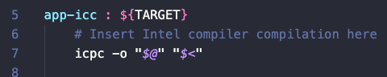
```
> zip -r helloworld.zip .
> scp hellowordl.zip colfax:/home/u48834
> ssh colfax
> unzip helloworld.zip
> make -f Makefile
> ./app-gcc
```

```
> ./app-icc
```
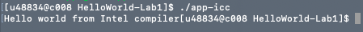


### Stencil

- [ver archivos](./ColfaxLabs/stencil)

El objetivo de este ejercicio es lograr mejorar el rendimiento en el tiempo de ejecución de detección de bordes en una imagen. Esta detección es usada en dinámica de fluidos y en procesamiento de imágenes.

Para evaluar si el rendimiento es bueno o no se tienen encuenta las siguientes preguntas: 

 - ¿Cuántos datos son procesados por segundo? GB/s
 - ¿Cuántas operaciones de coma flotante por segundo? GFLOPS

 En el paralelismo, mientras mayores sean estos números, mejor será el rendimiento, ya que se hará más uso del procesamiento por segundo.

 > As one of Intel's engineers has put it, if you're not using vectorization, you may be paying for 16 times the processor that you're using.

- Entrada => imagen de 36 Megapíxeles
- Salida => reverso de la imagen de entrada
- Formato => vectores de números de punto flotante
- Proceso => Se forma una matriz que atraviesa todos los pixeles. Cada pixel y sus 8 vecinos son multiplicados por los pesos en la matriz y luego sumados.
- Condición => el valor debe estar dentro de los límites de la intesidad de profundidad, 0 < x < 255 para una imagen en escala de gris de 8-bit

Ejecución:

```
> Forzar vectorización con SIMD
```
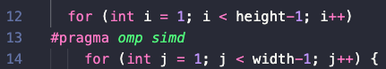

```
> Especificar el compilador a usar en el Makefile
```
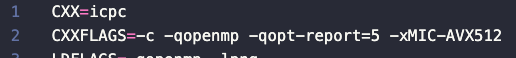
```
> make
> make queue
> cat edgedetection.o127503
```
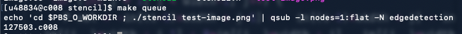

Ahora realizaremos este mismo programa pero de forma paralela para que haga uso de hilos.

Para ello, debemos agregar la declaración pragma para indicar la paralelización del ciclo.
```
> #pragma omp parallel for
```
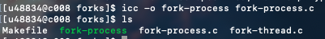

```
> make queue
> cat edgedetection.o127857
```

Esta declaración es segura hacerla ya que no tenemos concurrencia en el acceso de memoria para ninguna asignación dentro del ciclo, por lo que no es necesario hacer ninguna otra modificación.


Comparación

| Método | Time, ms | Speedup | GB/s | GFLOP/s | reporte |
| ------------ | ------------- | ------------- | ------------- | ------------- | ------------- |
| Original |477.9+-1.3 | 4 | 0.6+-0.0 | 1.4+-0.0 | [ver](./ColfaxLabs/stencil/edgedetection.o127503) |
| Vectorizado | 40.6+-0.3 | 16.380 | 7.1+-0.1 | 16.0+-01 | [ver](./ColfaxLabs/stencil/edgedetection.o127505) |
| Threads | 7.3+/0.0 | 16.380 | 39.6+-0.2 | 89.1+-0.5 | [ver](./ColfaxLabs/stencil/edgedetection.o127857) |


### Integral

- [ver archivos](./ColfaxLabs/integral)

En este ejercicio se utilizará la integración numérica. La función tiene 3 argumentos de entrada:
  - **n** indica los pasos que tendrá el ciclo = 1 billón
  - **a** donde comienza el intervalo
  - **b** donde termina el intervalo

Optimización: 

```
> Especificar el compilador Xeon Phi en el Makefile
```
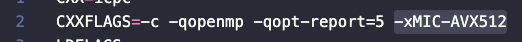

```
> Utilizar la función de reducción de simd en el worker.cc
```
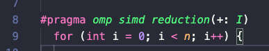

```
> Declarar simd tanto el library.o como library.h
```
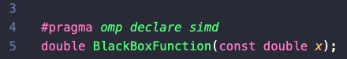
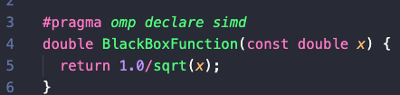

Comparación

| Método | Time, ms | Speedup | GSteps/s | reporte |
| ------------ | ------------- | ------------- | ------------- | ------------- |
| Básico | 95500.574 | 4 | 0.010 | [ver](./ColfaxLabs/integral/numintegr.o127562) |
| Vectorizado | 18829.7+-2.3 | 2.050 | 0.053 |  [ver](./ColfaxLabs/integral/numintegr.o127563) |
| Vectorizado + Xeon Phi | 6883.9+-0.7 | 2.050 | 0.145 | [ver](./ColfaxLabs/integral/numintegr.o127564) |


### Vectorizing Monte-Carlo Diffusion

- [ver archivos](./ColfaxLabs/vectorization-mc)

La aplicación genera una simulación de camino aleatorio de una dimensión. Se comienza en el centro, a cada paso, las partículas pueden moverse de manera aleatoria dada una función de distribución. El objetivo es encontrar el número de partículas que tienen una posión mayor a un límite dado.

diffusion.cc*
distribution.h*
distribution.cc*

Pasos:
```
> Indicar la vectorización de la función dist_func tanto en el archivo .h y .cc 
> #pragma omp declare simd
```
distribution.cc
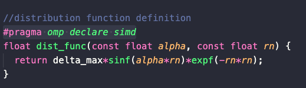

distribution.h
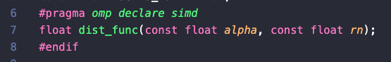

```
> Luego, cuando compilemos el programa, veremos en el reporte de optimización que efectivamente el ciclo fue vectorizado.
```
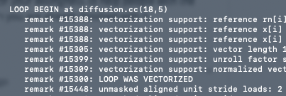


### Forks

- [ver archivos](./ColfaxLabs/forks)

En este ejercicio se realizan dos enfoques del paralelismo:
- Procesos: es un flujo de instrucciones con su propio espacio de memoria. Para intercambiar datos entre procesos, es necesario el paso de mensajes entre éstos.

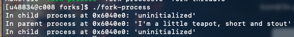

- Hilos: son flujos de instrucciones independientes que comparten el mismo espacio de memoria. Un hilo puedo leer de forma transparente, los datos en otro hilo.

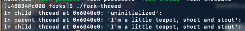


### Multithreaded Filtering

Este es el laboratorio #3

El programa realiza un filtro dado un número límite (threshold) y una matriz de 2 dimensiones. Cada fila de la matriz representa un vector de 1 dimension, donde se sumarán todos sus elementos. Se tendrá además una condición: el resultado de la suma de cada vector debe ser mayor al threshold. Si es mayor entonces e agrega el índice de la fila al vector de salida. Finalmente se ordena el vector de salida de menor a mayor.

Solución:

Podemos realizar la suma de cada vector en hilos independientes. Sin embargo, debemos tener cuidado con el **data race** que puede provocarse al hacer push en el vector de salida, puesto que dos o más hilos podrían intentar escribir sobre ese mismo espacio de memoria a la vez si la suma de su vector asignado cumple la condición.

1. Añadir la declaración para ejecución paralela del ciclo
```
> #pragma omp parallel for
```
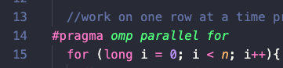

2. Añadir la declaración para el segmento donde puede ocurrir el **data race**
```
> #pragma omp critical
```
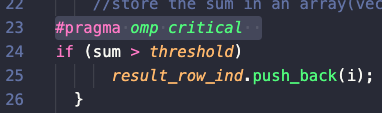


Comparación

| Método | Time, ms | reporte |
| ------------ | ------------- | ------------- |
| Secuencial | 3.814191 | [ver](./ColfaxLabs/threads-filter/lab2.o127874) |
| Multihilo |  0.456628 | [ver](./ColfaxLabs/threads-filter/lab2.o127877) |
