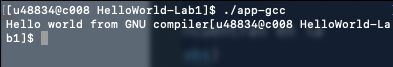

# mistyhpc
High performance computing project

##### Tabla de contenido 
[Colfax](#Colfax)  
[Hello World](#Hello\World) 
[Stencil](#Stencil)  


## Colfax
Los laboratorios del MOOC se encuentran en la carpeta [Colfax labs](./ColfaxLabs)

#### Hello World

Compilar un Hola mundo en el clúster. Se debe modificar el archivo Makefile para que use el compilador C++ de Intel, luego hacer un zip de éste únicamente y subirlo a la página de Colfax.

Pasos para ejecutar el programa
```
> Añadir línea faltante: icpc -o "$@" "$<"
```

```
> zip -r helloworld.zip .
> scp hellowordl.zip colfax:/home/u48834
> ssh colfax
> unzip helloworld.zip
> make -f Makefile
> ./app-gcc
```

```
> ./app-icc
```


#### Stencil

- [ver archivos](./ColfaxLabs/stencil)

El objetivo de este ejercicio es lograr mejorar el rendimiento en el tiempo de ejecución de detección de bordes en una imagen. Esta detección es usada en dinámica de fluidos y en procesamiento de imágenes.

Para evaluar si el rendimiento es bueno o no se tienen encuenta las siguientes preguntas: 

 - ¿Cuántos datos son procesados por segundo? GB/s
 - ¿Cuántas operaciones de coma flotante por segundo? GFLOPS

 En el paralelismo, mientras mayores sean estos números, mejor será el rendimiento, ya que se hará más uso del procesamiento por segundo.

 > As one of Intel's engineers has put it, if you're not using vectorization, you may be paying for 16 times the processor that you're using.

- Entrada => imagen de 36 Megapíxeles
- Salida => reverso de la imagen de entrada
- Formato => vectores de números de punto flotante
- Proceso => Se forma una matriz que atraviesa todos los pixeles. Cada pixel y sus 8 vecinos son multiplicados por los pesos en la matriz y luego sumados.
- Condición => el valor debe estar dentro de los límites de la intesidad de profundidad, 0 < x < 255 para una imagen en escala de gris de 8-bit

Ejecución:

```
> Forzar vectorización con SIMD
```


```
> Especificar el compilador a usar en el Makefile
```

```
> make
> make queue
> cat edgedetection.o127503
```


Comparación

Método | Time, ms | Speedup | GB/s | GFLOP/s | reporte
------------ | ------------- | ------------- | ------------- | -------------
Original |477.9+-1.3 | 4 | 0.6+-0.0 | 1.4+-0.0 | [Colfax labs](./ColfaxLabs/stencil/edgedetection.o127503) 
Vectorizado | 40.6+-0.3 | 16.380 | 7.1+-0.1 | 16.0+-01 | [Colfax labs](./ColfaxLabs/stencil/edgedetection.o127505)


